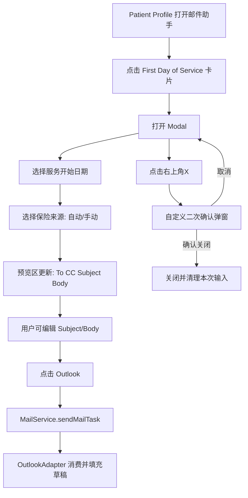

# ADR-022: First Day of Service 内置模板（Patient Profile 轻引导 Modal）架构决策

## 状态
Accepted (2026-06-10)

## 关联 Story

- `docs/stories/epic-16-story-5-first-day-of-service-template.md`

## 背景

Issue #27 目标是新增一个高频、标准化邮件场景：First Day of Service。该场景的核心特征是：

1. 发送入口固定在 Patient Profile 工作流中。
2. 收件人规则固定（To/CC 固定）。
3. 变量少且明确（服务开始日期 + 保险公司）。
4. 发送前需要可视化预览与可编辑能力。

同时，用户明确提出强约束：

1. UI 风格必须与现有 userscript 风格一致。
2. 关闭流程必须二次确认，且复用项目现有自定义确认弹窗。
3. 禁止使用浏览器原生 `alert` / `confirm` / `prompt`。
4. 仅允许点击右上角 X 触发关闭流程（遮罩/Esc 均不关闭）。

---

## 决策

### D1：采用“内置模板服务类”路径，而非自定义模板配置路径

**选定**：以独立内置模板类实现（与 `PatientVacationTemplate` / `EodReportTemplate` 同层级），由 `MailBuilderTab` 的 Built-in 区域渲染入口卡片。

**原因**：

1. 该场景业务规则固定，适合硬编码流程。
2. 需接入变量驱动与页面上下文检测，不适合仅靠 `TemplateManager` 自定义模板配置。

---

### D2：页面限制为 Patient Profile 专用

**选定**：仅在 `InternalPatientInfo_ns.aspx`（Patient Profile）可用；其他页面置灰不可点击。

**原因**：

1. 保险自动检测依赖 Patient Profile 授权上下文。
2. 避免在无上下文页面出现误操作入口。

---

### D3：Modal 布局采用“顶部变量区 + 下方预览编辑区”

**选定**：

1. 顶部变量区：服务开始日期、保险来源模式、保险选择器。
2. 下方预览区：To、CC、Subject、正文富文本编辑器。
3. Footer 右下仅一个按钮：`Outlook`。

**原因**：

1. 与现有“每日报告”操作心智一致。
2. 先选变量再预览编辑，符合轻引导路径。

---

### D4：收件人策略固定，不对用户开放配置

**选定**：

1. To 固定：`"RNs Coordinators" <Nursing@AlwaysNY.net>`。
2. CC 固定：
3. `"Reggie Thomas (Chief Operations Officer)" <rthomas@AlwaysNY.net>`
4. `"Ada Wu" <DWu@AlwaysNY.net>`
5. `"Tracy Vuong" <TVuong@AlwaysNY.net>`
6. `"Intake" <intake@AlwaysNY.net>`

**原因**：

1. 该业务链路收件对象稳定。
2. 降低配置成本和错误率。

---

### D5：变量模型与联动策略

**选定变量**：

1. 服务开始日期（必填）。
2. 保险公司（自动或手动）。

**主题/正文规则**：

1. Subject 仅包含服务开始日期变量。
2. 正文仅包含保险名与服务开始日期变量。

**联动策略**：

1. 默认预填内容会随变量变化自动刷新。
2. 若用户已手改正文，后续变量变化不强制覆盖正文（正文脏状态保护）。

---

### D6：保险数据采用“双源模式”

**选定**：

1. 自动检测源：`ProfileDataExtractor.extract().insurances`。
2. 全量手动源：页面 `#ctl00_ContentPlaceHolder1_uxDdlSource` 全部 `option`。
3. 若页面无法读取全量下拉，则使用 `FirstDayInsuranceFallback.ts` 内置全量快照作为 fallback。

**原因**：

1. 自动模式最快，适合常见场景。
2. 手动模式确保复杂多保险或异常场景可控。
3. 双源可兼顾准确性与健壮性。

---

### D7：关闭交互采用“硬限制 + 自定义确认弹窗”

**选定（强制）**：

1. 只有右上角 X 可触发关闭流程。
2. 点击遮罩不关闭。
3. Esc 不关闭。
4. 点击 X 后必须弹出项目内自定义二次确认弹窗。
5. 严禁调用 `alert` / `confirm` / `prompt`。

**原因**：

1. 满足用户明确交互约束。
2. 降低误触丢失输入风险。
3. 保持全局交互一致性。

---

### D8：发送链路复用现有 MailService/OutlookAdapter

**选定**：调用 `MailService.sendMailTask({ to, cc, subject, body })` 写入现有任务总线。

**原因**：

1. 复用已验证的跨 Tab Outlook 注入链路。
2. 不新增并行发送通道，降低维护面。

---

## 关键流程

---

## 被否决方案

| 方案 | 否决原因 |
|---|---|
| 直接走自定义模板 `TemplateManager` | 无法表达该场景的变量引导、自动保险检测与关闭硬约束 |
| 允许遮罩点击关闭 | 与用户“仅 X 触发关闭”要求冲突 |
| 使用原生 confirm 做二次确认 | 与“复用项目自定义确认弹窗”要求冲突 |
| Footer 放多个动作按钮（复制、取消等） | 与“右下角仅 Outlook”要求冲突 |

---

## 后果

### 正面影响

1. 业务路径更短，发送一致性更高。
2. 与现有内置模板架构兼容，开发风险低。
3. 严格关闭策略可显著降低误关损失。

### 负面影响 / 风险

1. 全量保险源依赖页面 select，可受页面结构变化影响。
2. 变量联动与正文手改并存时，状态管理复杂度增加。

### 缓解策略

1. 保险列表采用“动态读取 + fallback 快照”。
2. 引入正文脏状态标记，避免变量更新覆盖用户输入。

---

## 实施边界

1. 仅覆盖 First Day of Service 模板场景。
2. 不扩展为通用收件组管理能力。
3. 不改动 Outlook 自动点击发送策略（保持只填充草稿）。

---

## 相关文档

1. `docs/stories/epic-16-story-5-first-day-of-service-template.md`
2. `docs/stories/epic-16-builtin-templates.md`
3. `docs/adr/016-employment-activation-request-wizard.md`
