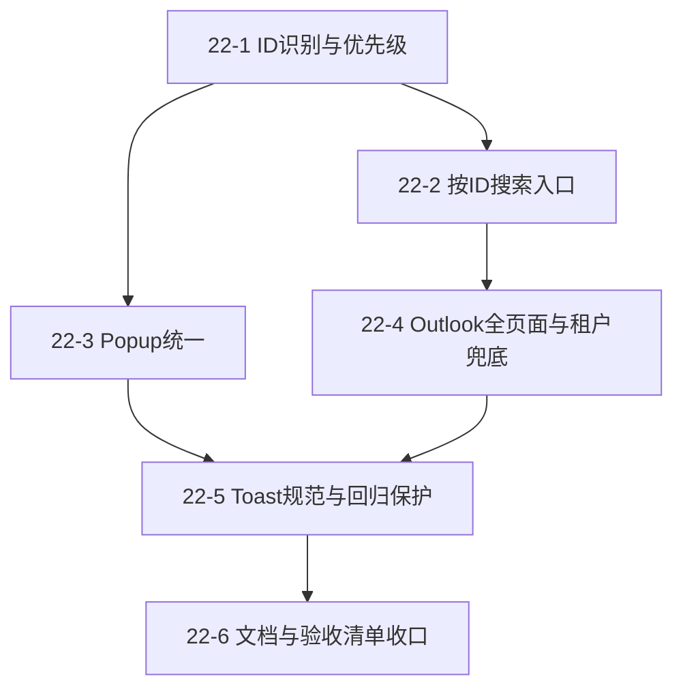

# Epic 22: Highlight ID Search（AHC/AMD）与 Toast 回归防护

## Epic 概述

| 属性 | 值 |
|---|---|
| **Epic ID** | EPIC-022 |
| **标题** | Highlight ID Search（支持 AHC/AMD） |
| **优先级** | P1 |
| **状态** | Completed (2026-05-28) |
| **关联系统** | Highlight2Call, HhaSearchService, IncomingCallHandler, Outlook 集成入口 |
| **依赖 Epic** | Epic 5（搜索结果处理基础）, Epic 18（HhaSearchService 多字段搜索能力）, Epic 19（Outlook Mini Panel） |
| **ADR** | ADR-020 |

## 背景

用户已确认目标体验：

1. 在 Outlook 与 HHA 页面高亮 `AHC-XXXX`~`AHC-XXXXXX` 或 `AMD-XXXX`~`AMD-XXXXXX`（4-6 位数字）后，出现浮层按钮“在HHAeXchange搜索”。
2. 点击后直接弹出搜索结果页。
3. 支持小写输入（如 `ahc-123456`），但不支持无连字符格式（如 `AHC123456`）。
4. 同时命中电话与 ID 时，优先执行 ID 搜索。
5. 无结果时显示轻提示 toast，不在 action popup 内显示“未找到”。
6. UI 保持与现有模块一致，并显式防止 toast 的位置/颜色/层级回归。

---

## Epic 目标

在不破坏现有 `highlight2call` 电话能力的前提下，新增“划词即搜 ID”的完整链路，覆盖 HHA + Outlook 全页面，且将 toast 视觉和层级问题纳入可执行验收标准。

---

## 成功标准

### 功能标准

1. 选中 `AHC-1234`~`AHC-123456` / `AMD-1234`~`AMD-123456`（大小写均可）时出现 ID action popup。
2. 点击“在HHAeXchange搜索”后直接进入结果弹窗（Combined/Single View 规则与现有一致）。
3. 同时命中电话和 ID 时，始终优先 ID。
4. 双端无结果时显示轻提示 toast。
5. Outlook 域名下全页面可用，不仅限某个区域。

### 质量标准

1. popup 风格与现有 `highlight2call` 一致。
2. toast 位置、颜色、层级、动画满足统一规范，不出现历史回归。
3. `npm run build` 通过，无新增 TypeScript 错误。

---

## 实施完成情况（2026-05-28）

- [x] Story 22-1：完成 ID 优先识别，规则调整为 4-6 位数字并保持大小写兼容。
- [x] Story 22-2：完成 `searchHhaById` 直出结果弹窗链路（aide/patient 并行查询 + 分流展示）。
- [x] Story 22-3：完成 ID popup 复用与点击行为统一，补齐点击后的二次触发抑制。
- [x] Story 22-4：完成 Outlook 全页面生效，并补齐 CallReports iframe 场景触发。
- [x] Story 22-5：完成顶部居中 toast 统一反馈与回归修复。
- [x] Story 22-6：完成 ADR/Epic 文档同步与验收收口。
- [x] 用户手动验收通过（Issue #25）。

---

## Stories

### Story 22-1: 扩展 Highlight2Call 为 ID 优先识别

**作为** 用户，
**我需要** 高亮 ID 即可触发搜索动作，
**以便** 避免手动复制粘贴到搜索输入框。

#### 验收标准

1. 新增 ID 正则，支持大小写匹配并强制连字符：`\b(?:AHC|AMD)-\d{4,6}\b`（`i`）。
2. 命中后标准化为大写用于后续搜索。
3. 若同一选区同时命中电话与 ID，优先按 ID 分支处理。
4. 未命中 ID 且命中电话时，原电话分支行为保持不变。
5. 监听策略保持 capture phase + 延后一拍读取选区，避免旧页面吞事件导致漏检。

#### 测试样例

| 选中文本 | 期望 |
|---|---|
| `AHC-1760` | 触发 ID popup |
| `AHC-123456` | 触发 ID popup |
| `ahc-123456` | 触发 ID popup（内部转大写） |
| `AMD-654321` | 触发 ID popup |
| `amd123456` | 不触发 ID popup |
| `Call me at 917-555-1212 and AHC-123456` | 优先 ID popup |

---

### Story 22-2: 新增按 ID 的搜索入口并直出结果弹窗

**作为** 用户，
**我需要** 点击 popup 按钮后直接看到结果，
**以便** 缩短完成搜索的总路径。

#### 验收标准

1. 新增按 ID 调用入口（如 `searchHhaById(id: string)`）。
2. 入口内部并行查询两端：
   - `fetchAllPages("aide", { id })`
   - `fetchAllPages("patient", { id })`
3. 结果分流：
   - 双端有结果 -> `displayCombinedResults`
   - 单端有结果 -> `displaySingleResult`
   - 双端无结果 -> 轻提示 toast
4. 不通过 Quick Search Tab 中转，不要求用户额外输入。

#### 说明

本 Story 明确采用“直接弹结果页”策略，不引入“自动切 Tab 并填值”的额外复杂度。

---

### Story 22-3: 统一 ID Action Popup 视觉与交互

**作为** 用户，
**我需要** ID 弹窗与现有电话弹窗视觉一致，
**以便** 获得连续、可预测的交互体验。

#### 验收标准

1. ID popup 复用现有 `#highlight-caller-popup` 视觉语言（字体、圆角、阴影、按钮样式、关闭行为）。
2. popup 显示内容包含：标题、选中 ID 文本、“在HHAeXchange搜索”按钮、关闭按钮。
3. 点击 action 后先关闭 popup，再执行搜索。
4. 不在 popup 内展示“未找到”文案（失败反馈由 toast 统一承担）。

---

### Story 22-4: Outlook 全页面生效与租户兜底

**作为** 用户，
**我需要** 在 Outlook 任意页面都能用划词 ID 搜索，
**以便** 不受页面区域限制。

#### 验收标准

1. Outlook 域名下全页面启用 ID 划词能力。
2. 若 Outlook 环境无法解析租户且无缓存，显示 toast 指引“请先打开一次 HHA 页面同步租户信息”。
3. 在 HHA 页面访问后，Outlook 可复用缓存租户继续搜索。
4. 不影响现有 Outlook Mini Panel 与邮件自动化入口。

---

### Story 22-5: Toast 规范化与回归保护

**作为** 用户，
**我需要** 搜索反馈 toast 位置稳定、颜色可读、不会被遮挡，
**以便** 在不打断操作的情况下获得清晰反馈。

#### 验收标准

1. toast 定位采用顶部居中：
   - `position: fixed`
   - `top: 20px`
   - `left: 50%`
   - 带 `translateX(-50%)` 过渡
2. 字体与颜色满足可读性：13-14px，白字，状态背景色清晰区分。
3. `z-index` 高于常见 modal/overlay，避免“提示出现但看不见”。
4. 动效完整（淡入/位移 + 自动消失），不抢焦点、不阻塞点击。
5. 回归测试必须覆盖：
   - 不再出现在左下角
   - 不被 overlay 遮挡
   - 字体颜色不与背景冲突
   - 动画不会缺失

---

### Story 22-6: 文档与验收清单更新

**作为** 团队成员，
**我需要** 在 ADR/Epic 中明确行为边界与测试矩阵，
**以便** 减少实现偏差和回归遗漏。

#### 验收标准

1. 新增 ADR-020（本 Epic 的决策依据）。
2. Epic 文档包含明确的边界规则：
   - 小写可匹配
   - 无连字符不匹配
   - ID 优先级高于电话
   - 无结果仅 toast
3. 验收矩阵覆盖 HHA 与 Outlook 双域场景。

---

## 依赖关系

---

## 文件清单（实际）

| 操作 | 文件路径 |
|---|---|
| 已修改 | `src/js/Highlight2Call.ts` |
| 已修改 | `src/js/IncomingCallHandler.ts` |
| 已修改 | `src/js/services/HhaSearchService.ts` |
| 已修改 | `src/index.ts` |
| 已更新 | `docs/adr/020-highlight-id-search-popup.md` |
| 已更新 | `docs/stories/epic-22-highlight-id-search.md` |

---

## 回归测试清单（摘要）

- [x] HHA 页面：选中 `AHC-123456` 能出 popup，点击后直出结果页。
- [x] Outlook 页面：选中 `amd-123456` 能出 popup，点击后直出结果页。
- [x] 选区含电话 + ID：只走 ID 搜索。
- [x] 无连字符 ID：不触发 ID 搜索。
- [x] 无结果：只出现 toast，不在 popup 中出现失败文案。
- [x] toast 在 modal 覆盖场景下仍可见，且颜色与字体可读。

---

## 关联

1. Issue #25: HHAexchange 辅助脚本增加 Highlight 搜索 AHC/AMD ID（支持病人和护理员）
