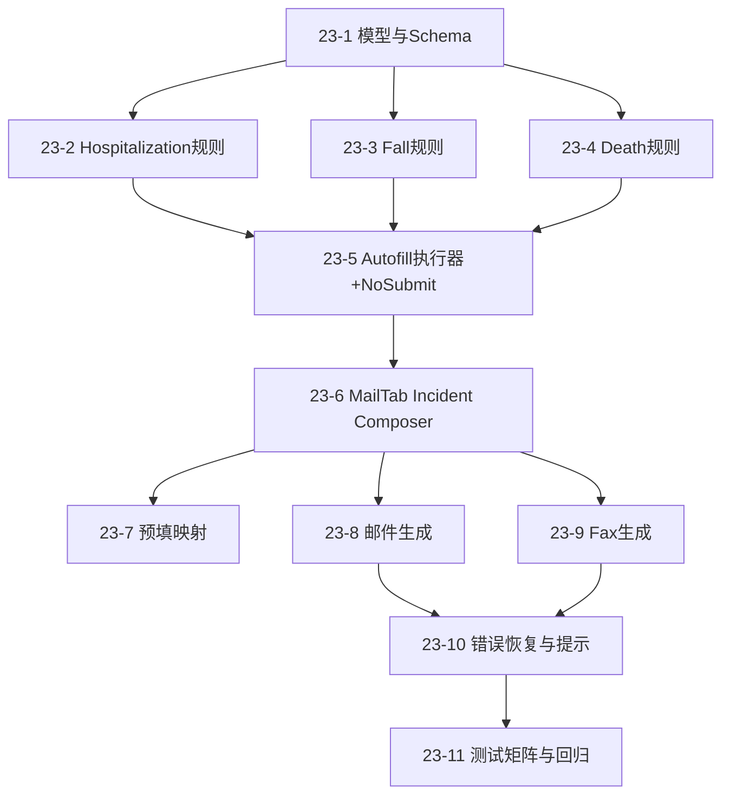

# Epic 23: Incident Links 自动填写与邮件/Fax 一次性生成（Hospitalization / Fall / Death）

## Epic 概述

| 属性 | 值 |
|---|---|
| **Epic ID** | EPIC-023 |
| **标题** | Incident Links 自动填写与邮件/Fax 一次性生成 |
| **优先级** | P0 |
| **状态** | 📝 draft（Ready for implementation） |
| **关联系统** | MailBuilderTab, ProfileDataExtractor, MailService, FaxPreviewModal, 内置模板体系 |
| **依赖 Epic** | Epic 12（Mail Builder）, Epic 17（Fax Template）, Epic 18（Quick Search）, Epic 19（Outlook 面板） |
| **ADR** | ADR-021 |
| **关联 Issue** | #19 |

## 背景

该需求不是“再加一个模板按钮”，而是要把三条高频事故上报链路做成统一的一次性工作台：

1. 自动填写 Hospitalization / Fall / Death 官方 Form。
2. 同步生成邮件与 Fax 文案。
3. 精确复刻官方所有问题与子问题。
4. 全流程禁止自动 Submit。

已通过实时逆向确认：

1. 三个官方 Form 均存在运行时动态分支。
2. Hospitalization 和 Fall 的条件逻辑较深，不能靠静态字段映射。
3. HCSS（NHTD/TBI）路径和 HHA/PCA 路径在 Hospitalization、Fall 中都存在前置分支问题。

---

## Epic 目标

在浮动面板 Mail Tab 内交付 Incident Composer，一次完成：

1. 采集和校验事件信息。
2. 根据官方规则生成对应 Form 填充计划。
3. 执行“可提交前”自动填充（不提交）。
4. 生成邮件与 Fax 内容并进入现有发送/预览链路。

---

## 非目标

1. 不构建多草稿管理系统（draft list / 恢复历史 / 审批）。
2. 不自动点击任何官方 Submit 按钮。
3. 不重构现有 Mail/Fax 全链路，只做兼容式接入。
4. 不重设计官方问题树，仅复刻官方行为。

---

## 成功标准

### 功能标准

1. 三类 Incident（Hospitalization/Fall/Death）均能自动填充到官方 Form 的提交前状态。
2. 条件子题触发与官方表现一致（含 HCSS 前置页、Infections 分支、911 分支等）。
3. 邮件与 Fax 从同一 Incident Payload 生成，字段内容一致。
4. 在 Mail Tab 内即可完成主要输入，不要求回到 Profile 页面操作。

### 安全标准

1. 自动化过程对 Submit 行为 100% 拦截。
2. 执行日志可追踪“填了哪些字段、拦截了哪些动作”。

### 质量标准

1. 分支覆盖测试通过（核心组合见本 Epic 测试矩阵）。
2. 不破坏现有 MailBuilder/Fax 入口与现有模板能力。
3. `npm run build` 通过，无新增 TypeScript 错误。

---

## 用户流程

### 流程 A：标准一次性上报（推荐路径）

1. 用户打开浮动面板 Mail Tab。
2. 选择 Incident 类型（Hospitalization/Fall/Death）。
3. 系统从患者上下文预填基础信息（姓名、DOB、Admission ID、服务类型等）。
4. 用户补齐剩余字段。
5. 系统根据分支规则动态展示必填项。
6. 用户点击“自动填写官方 Link”（仅填充，不提交）。
7. 系统返回填充摘要 + 人工复核提示。
8. 用户生成并检查邮件/Fax，走现有发送流程。

### 流程 B：HCSS 特殊路径（Hospitalization/Fall）

1. 服务类型为 HCSS（NHTD/TBI）时，系统自动切换合同字段和前置问题。
2. Hospitalization 先处理 NHTD/TBI Case 与报告时间后再进入 Details。
3. Fall 先处理 NHTD/TBI Case 与报告时间，再进入事故问题树。

---

## Stories

### Story 23-1：建立 Incident 统一领域模型与 Schema Registry

**作为** 开发者，
**我需要** 一个统一的 Incident Payload 和 schema 注册中心，
**以便** 三类表单共享同一套数据与规则执行基础。

#### 验收标准

1. 新建 Incident 统一类型定义（patient/reporter/timeline/formData/generated/safety）。
2. 新建 schema registry，可按 incidentType 读取字段定义与规则。
3. schema 支持字段属性：required、options、visibility rules、normalizer。
4. schema 与 UI 解耦，不直接引用 DOM。
5. `npm run build` 通过。

---

### Story 23-2：Hospitalization 表单规则实现（含 HCSS 前置页）

**作为** 业务用户，
**我需要** Hospitalization 自动填表完全跟随官方问题树，
**以便** 避免漏填和错误分支。

#### 验收标准

1. Page 1 支持服务分支：
2. HHA/PCA -> Vendor/Contract（41 项）
3. HCSS -> NHTD/TBI Contract（2 项）
4. HCSS 路径必须支持中间页：
5. NHTD/TBI Case（多选）
6. 报告时间（文本）
7. Details 页基础字段全部支持：Date/Time/Hospital Name/During Service Hours/Reason/Source/Name/Notes。
8. Reason 分支支持：
9. Infections -> Type of Infection + Infection - Details
10. Planned Hospitalization / Respiratory Distress / Trauma / Injury / Unwell (Malaise) / Wound -> Accident
11. Reason=Other 且未填文本时，下游字段隐藏行为与官方一致。

---

### Story 23-3：Fall 表单规则实现（含 911 与服务时段分支）

**作为** 业务用户，
**我需要** Fall 自动填表正确展开条件子题，
**以便** 一次填全且不误判。

#### 验收标准

1. Q1 Type of Accident 八种选项 + Other。
2. Q5 Services 分支支持：
3. NHTD/TBI -> 先出现 NHTD/TBI Case + 报告时间。
4. 911 分支支持：
5. Was 911 dialed=Yes -> 出现 Who called 911。
6. No/Unknown -> 不出现 Who called 911。
7. During service hours 分支支持：
8. Yes -> Caregiver Name & Code + Where was aide...
9. No -> 不出现上述两题。
10. 末尾风险评估四题始终存在。

---

### Story 23-4：Death 表单规则实现

**作为** 业务用户，
**我需要** Death 自动填表稳定且简单，
**以便** 低风险完成死亡上报信息录入。

#### 验收标准

1. 完整覆盖 Q1-Q7。
2. Q5/Q6/Q7 选项集与官方一致。
3. Other answer 仅作为内联文本，不引出额外子题。
4. Vendor 下拉 43 项可正确映射。

---

### Story 23-5：Form Autofill Orchestrator 与 No-submit Guard

**作为** 团队，
**我需要** 一个统一执行器来驱动填表，并强制禁止提交，
**以便** 自动化可控、可追踪、可审计。

#### 验收标准

1. 执行器可按 schema 顺序填充字段并等待动态分支渲染。
2. 支持多页流程（含 Back/Next，仅用于页面导航）。
3. 内置 Submit 拦截：
4. 拦截 type=submit、文本/aria-label 包含 Submit 的触发。
5. 拦截日志落地到运行结果对象。
6. 执行结果返回：成功字段数、失败字段清单、阻断动作清单。

---

### Story 23-6：Mail Tab Incident Composer 一次性工作台

**作为** 业务用户，
**我需要** 在 Mail Tab 内完成事件录入与执行，
**以便** 不离开当前工作区即可完成主任务。

#### 验收标准

1. 在 Mail Tab 增加 Incident Composer 区块（类型切换 + 表单区域）。
2. UI 根据 schema 动态展示字段与必填提示。
3. 保留“一键预填患者信息”入口。
4. 支持执行前校验、执行后摘要、人工复核提示。
5. 会话状态为 one-shot：页面刷新后不保留复杂草稿。

---

### Story 23-7：Profile 数据预填与字段映射

**作为** 用户，
**我需要** 自动带入患者基础信息，
**以便** 降低重复输入。

#### 验收标准

1. 复用并扩展现有 ProfileDataExtractor 输出。
2. 至少覆盖：Patient Name、DOB、Admission ID、Service、Contract/Vendor 候选值。
3. 对无法确定字段给出显式待补提示，不静默跳过。
4. 映射错误不阻断整个流程，可人工改值后继续。

---

### Story 23-8：邮件内容生成接入

**作为** 用户，
**我需要** 基于 Incident Payload 直接生成邮件草稿，
**以便** 快速发送事件通知。

#### 验收标准

1. 生成邮件主题与正文模板（按 incidentType 分支）。
2. 邮件内容包含关键字段摘要（患者、事件时间、类型、上报人、备注）。
3. 接入现有 MailService / OutlookAdapter，不破坏既有任务总线。
4. 支持用户在发送前人工编辑。

---

### Story 23-9：Fax 内容生成与预览接入

**作为** 用户，
**我需要** 同源生成 Fax 文本并可预览，
**以便** 与邮件内容保持一致并减少差错。

#### 验收标准

1. 从同一 Incident Payload 生成 Fax 内容。
2. 复用现有 FaxPreviewModal 流程进行预览与确认。
3. 与邮件关键字段保持一致（允许格式差异，不允许语义差异）。
4. 必要时可追加 General Notes 入口，不改变既有保存链路。

---

### Story 23-10：运行校验、错误恢复与用户提示

**作为** 用户，
**我需要** 在失败时知道缺了什么、下一步做什么，
**以便** 快速修正而不是重来。

#### 验收标准

1. 校验层区分：必填缺失、选项不匹配、页面分支未达成、目标字段不可交互。
2. 错误提示必须包含字段名和建议动作。
3. 支持“从上次输入继续”（当前会话内）。
4. 执行结束固定提示“未提交，请人工最终提交”。

---

### Story 23-11：测试矩阵与回归收口

**作为** 团队，
**我需要** 可执行的分支测试矩阵，
**以便** 每次改动都能快速验证关键路径。

#### 验收标准

1. 建立三表核心分支用例集。
2. 至少覆盖以下组合：
3. Hospitalization: Infections、Wound、Trauma/Injury、Planned Hospitalization、Reason Other。
4. Fall: Service=NHTD/TBI、911=Yes/No/Unknown、ServiceHours=Yes/No。
5. Death: Q5/Q6/Q7 关键选项组合。
6. No-submit 拦截用例必须单列并每次回归执行。
7. 文档更新：ADR 与 Epic 状态、实施记录、已知限制。

---

## 关键规则清单（实现必须对齐）

### Hospitalization

1. HCSS 路径先过 NHTD/TBI 页面，再进 Details。
2. Reason=Infections 出现 Type of Infection 与 Infection - Details。
3. Reason 属于以下集合时出现 Accident：
4. Planned Hospitalization
5. Respiratory Distress
6. Trauma / Injury
7. Unwell (Malaise)
8. Wound

### Fall

1. Service=NHTD/TBI 时新增 NHTD/TBI Case + 报告时间。
2. Was 911 dialed=Yes 才出现 Who called 911。
3. During service hours=Yes 才出现 Caregiver Name & Code 与 Aide whereabouts。

### Death

1. 无额外动态子页。
2. Other answer 仅内联，不引出额外问题。

---

## 依赖关系

---

## 计划文件清单（建议）

| 操作 | 文件路径 |
|---|---|
| 新建 | `src/js/services/incident/IncidentTypes.ts` |
| 新建 | `src/js/services/incident/IncidentSchemaRegistry.ts` |
| 新建 | `src/js/services/incident/forms/HospitalizationSchema.ts` |
| 新建 | `src/js/services/incident/forms/FallSchema.ts` |
| 新建 | `src/js/services/incident/forms/DeathSchema.ts` |
| 新建 | `src/js/services/incident/IncidentAutofillOrchestrator.ts` |
| 新建 | `src/js/components/IncidentComposerPanel.ts` |
| 修改 | `src/js/tabs/MailBuilderTab.ts` |
| 修改 | `src/js/services/ProfileDataExtractor.ts` |
| 修改 | `src/js/services/MailService.ts`（按需补字段） |
| 修改 | `src/js/components/FaxPreviewModal.ts`（按需接 Incident Payload） |
| 修改 | `src/index.ts`（按需注册入口） |
| 文档 | `docs/adr/021-incident-one-shot-autofill-mail-fax.md` |
| 文档 | `docs/stories/epic-23-incident-links-autofill-and-mail-fax.md` |

---

## 风险与缓解

| 风险 | 说明 | 缓解 |
|---|---|---|
| 官方 Form 结构漂移 | 字段文案、顺序或分支变化 | schema 版本化 + 运行时字段巡检告警 |
| 误触提交风险 | 自动化误点 Submit | No-submit guard 多层拦截 + 阻断日志 |
| 映射不完整 | Profile 数据缺失导致半自动 | 显式待补提示 + 允许人工继续 |
| 规则复杂度升高 | Hospitalization/Fall 分支多 | 规则单测 + 分支矩阵回归 |

---

## 验收测试矩阵（摘要）

| 用例ID | 场景 | 输入组合 | 期望 |
|---|---|---|---|
| TC-23-H-01 | Hospitalization 基础 | Reason=Abdominal Pain | 仅基础字段，无 Accident/感染子题 |
| TC-23-H-02 | Hospitalization 感染分支 | Reason=Infections, Type=UTI | 出现 Type of Infection + Infection - Details |
| TC-23-H-03 | Hospitalization 事故分支 | Reason=Wound | 出现 Accident |
| TC-23-H-04 | Hospitalization HCSS 路径 | Service=HCSS | 出现 NHTD/TBI 前置页后进入 Details |
| TC-23-F-01 | Fall 基础 | Service=HHA, 911=No, ServiceHours=No | 不出现 Who called 911，不出现 caregiver/aide 两题 |
| TC-23-F-02 | Fall 911分支 | Service=PCA, 911=Yes | 出现 Who called 911 |
| TC-23-F-03 | Fall 服务时段分支 | Service=PCA, ServiceHours=Yes | 出现 Caregiver Name & Code + Aide whereabouts |
| TC-23-F-04 | Fall HCSS 路径 | Service=NHTD/TBI | 出现 NHTD/TBI Case + 报告时间 |
| TC-23-D-01 | Death 标准路径 | Q5=Family, Q6=HCSS | Q1-Q7 全量可填，无新增子题 |
| TC-23-SAFE-01 | 提交保护 | 任意执行过程遇 Submit 控件 | 自动化阻断，不提交 |

---

## 交付定义（Definition of Done）

1. 11 个 Story 全部验收通过。
2. 三类 Incident 核心分支测试全绿。
3. No-submit 拦截测试全绿。
4. 邮件/Fax 生成链路通过业务验收。
5. 文档（ADR + Epic）与实现保持一致。
